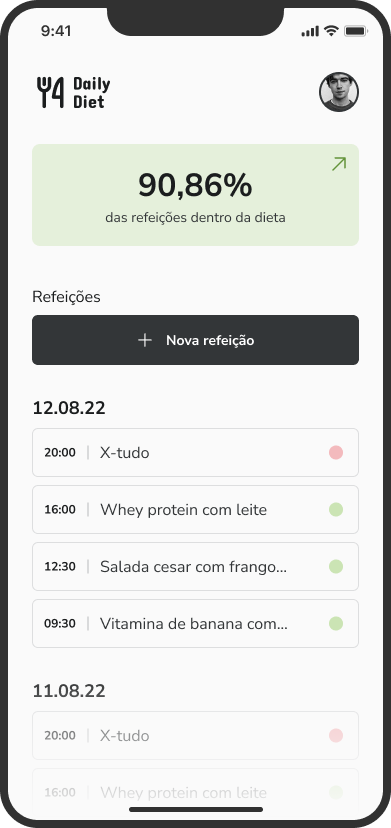
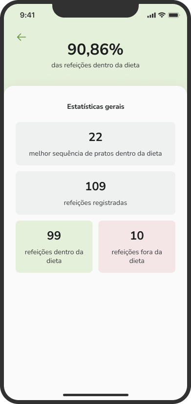
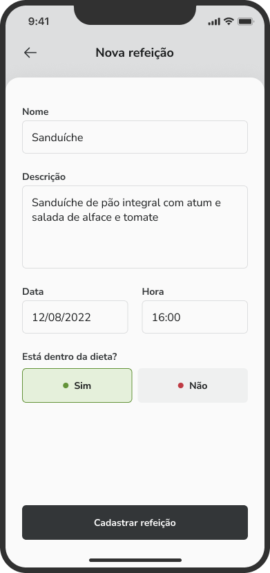
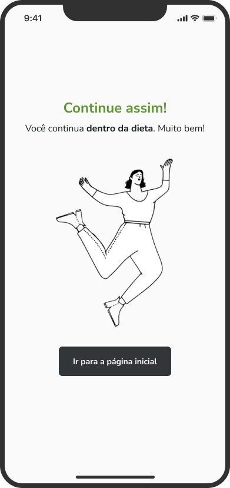
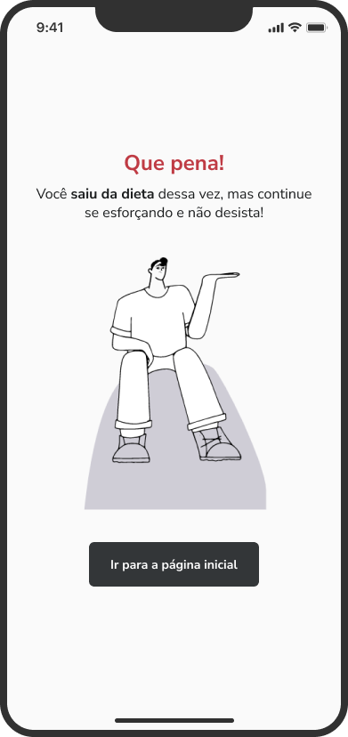
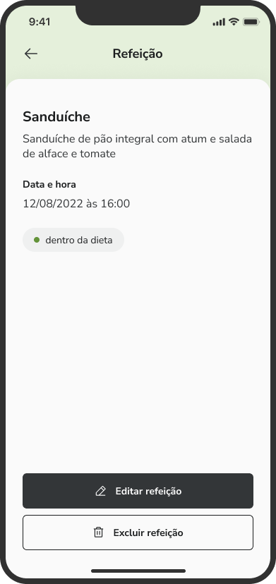
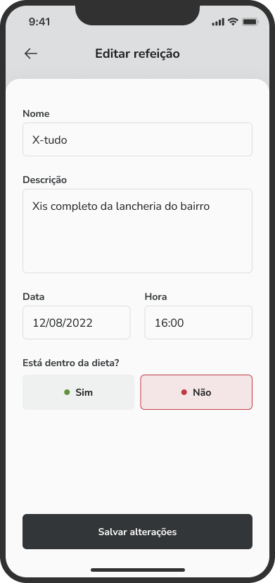
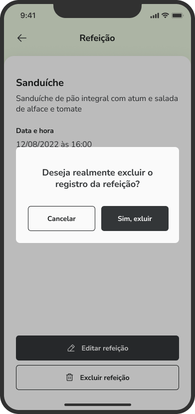

# daily-diet

This project was generated with [Expo CLI](https://github.com/expo/expo-cli) version 6.0.8

This app allows you manage your daily meals to figure out how healthy your diet is.

## Features

- Add a new meal
- Edit a meal
- Remove a meal from the listing
- Show diet progress statistics
- Navigation between stacked screens
- Local storage meals through Async Storage

## Technologies

- Custom fonts added through Expo Fonts
- Path mapping configured through Babel and Typescript
- Styled components used to style React Native Core Components and set a global theme
- Stack Navigation provided by React Navigation

## Layout

  
  
  
  
  
  
  
  

## Running project

Run `npm install` to install all project dependencies and run `npm start` to execute the app. This command will generate a QR Code to you scan an run the app on your smartphone since it and the computer been the same Wi-fi network ou simply run the app in your favorite Android emulator from your computer.
